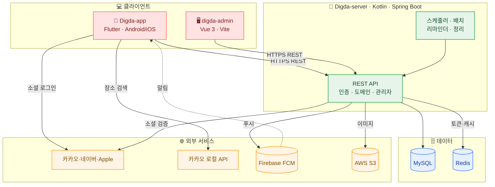

# 태리팟 · Taeripot

### 가까운 사람들과 일상을 함께 담는 그룹 다이어리, **디그팟**

**디그팟(DigPot)** = **Di**gital **G**roup **Pot** · *디지털 그룹 포켓(Digital Group Pocket)*
가족·연인·친구를 위한 **비공개 그룹 다이어리** 서비스를 만드는 팀입니다.

---

## 🍙 디그팟이란?

초대 코드로 모인 소규모 그룹이 **그림일기 · 일정 · 투두 · 캐릭터(모찌)** 를 한 주머니(Pocket)에 담아
함께 기록하고 공유하는 모바일 서비스입니다. 모든 콘텐츠는 그룹 밖으로 노출되지 않는 **비공개**가 기본입니다.

- 🔒 **비공개 그룹** — 초대 코드로만 입장, 외부 비노출
- 🖼️ **그림일기** — 하루 한 편, 사진·기분·날씨·장소와 함께
- 📅 **공유 일정** — 월/주 캘린더, 멤버 필터, 리마인더 알림
- 🐱 **모찌 키우기** — 함께 키우며 진화하는 그룹 마스코트
- 🔔 **실시간 알림** — 일정·일기·댓글·그룹 활동 푸시

---

## 🖼️ 서비스 화면

| 그룹 홈 | 일정 캘린더 | 그림일기 | 모찌 키우기 | 알림 |
|:---:|:---:|:---:|:---:|:---:|
|  |  |  |  |  |

---

## 🗂️ 레포지토리

| 레포 | 설명 | 스택 |
|---|---|---|
| **[Digda-app](https://github.com/DateDiary/Digda-app)** | 디그팟 모바일 앱 (Android · iOS) | Flutter · Dart |
| **[Digda-server](https://github.com/DateDiary/Digda-server)** | 백엔드 API 서버 | Kotlin · Spring Boot · MySQL · Redis |
| **[digda-admin](https://github.com/DateDiary/digda-admin)** | 운영 관리자 대시보드 | Vue 3 · TypeScript · Vite |

---

## 🏗️ 시스템 아키텍처

---

## 🛠️ 기술 스택

| 영역 | 기술 |
|---|---|
| **App** | Flutter, Dart, provider, dio, go_router, table_calendar, firebase_messaging |
| **Server** | Kotlin, Spring Boot 3, JPA/MySQL, Redis, Spring Security/JWT, OpenFeign, Firebase Admin, AWS S3 |
| **Admin** | Vue 3, TypeScript, Vite |
| **Infra/CI** | Docker, GitHub Actions, NCP, Vercel(admin) |

---

## 🤝 협업 방식

- 통합 브랜치 **`dev`** 기준 개발·배포 (PR base = `dev`)
- 라벨 체계 **Type · Priority · Status · Domain**, 이슈/PR 템플릿 운용
- 버전 단위 **마일스톤**, 기본 담당자/리뷰어 지정(CODEOWNERS)
- 자세한 규칙은 각 레포의 `.github/CONTRIBUTING.md` 참고

---

© 2026 태리팟(Taeripot) · 디그팟(DigPot) — Digital Group Pocket

